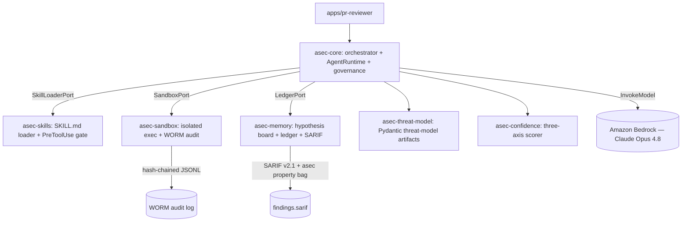

The agent's job is to find security defects in target code. v1 implements that
as a closed loop:

1. **Read.** Claude Opus 4.8 reads the target repo and the seed
   `threat-model.yaml` to enumerate candidate hypotheses ("this `account_api`
   handler may be vulnerable to Insecure Direct Object Reference / CWE-639").
2. **Run.** The orchestrator dispatches each hypothesis to a per-experiment
   Docker / gVisor sandbox (`--network=none` by default), running attacker
   inputs and observing the response.
3. **Verify.** A hypothesis is confirmed only if the sandbox produces a Proof
   of Concept (PoC) or a counter-example. Confirmed findings land in a
   durable ledger and are emitted as Static Analysis Results Interchange
   Format (SARIF) v2.1.

This trades a Static Application Security Testing (SAST) flood for a
verify-by-running loop. The agent earns each finding by observing the
behavior, not by pattern-matching alone.

## The three faculties

| Faculty | What it is | Implemented in |
|---|---|---|
| Eyes | Claude Opus 4.8 on Amazon Bedrock — lexical + abstract syntax tree (AST) + cross-reference search over the target repo | `asec-core` (`AgentRuntime` Protocol + `ClaudeAgentRuntime`) |
| Hands | A per-experiment sandbox: Docker rootless or gVisor `runsc`, `--cap-drop=ALL`, `--read-only`, deny-default networking, optional egress allowlist sidecar | `asec-sandbox` |
| Memory | An append-only hypothesis board, a durable findings ledger (SQLite locally, Postgres in cloud), and a hash-chained audit log of every tool call and gate decision | `asec-memory` (board + ledger) and `asec-sandbox` (audit log) |

## High-level architecture

## Confidence dispatch

Not every finding deserves the same effort. `asec-confidence` scores each
candidate on three axes — pattern match, memory recall, reachability — and
the orchestrator picks the cheapest mode whose confidence band is sufficient:

| Score | Mode |
|---|---|
| ≥ 0.85 | Specialized worker (one focused agent) |
| ≥ 0.70 | Parallel shell (a few specialists in parallel) |
| ≥ 0.40 | Swarm (broad fan-out) |
| < 0.40 | Runtime tool authorship (the agent writes a custom probe) |

Cheap deterministic paths run first; expensive autonomy is earned, not
default. Scoring math is fixed in
[ADR-008](/agentic-security-lab/adrs/0008-pluggable-confidence-strategy-bm25/);
dispatch lives in `asec-core`.

## Phase Zero: agent authors its own threat model

When a new repository has no `threat-model.yaml`, the agent writes one
(boundaries, assets, data-flow diagram, STRIDE threats) **before**
dispatching any audit worker. This is what unlocks autonomous onboarding on
an unfamiliar repo: the threat model is a first deliverable the agent owns,
not a prerequisite a human has to draft. v1 ships with a hand-written
fixture; Phase Zero authoring is wired but not exercised end-to-end yet.

## Adversarial CI: re-audit the agent

The agent is a piece of software with skills, prompts, and tool-calls — that
makes it an attack surface in its own right. A continuous-integration job
runs four planted-canary classes against a hermetic fake `AgentRuntime` on
every change to skills, prompts, or the orchestrator, and blocks deploy on
any miss. Details: [Adversarial CI in the README](https://github.com/theagenticguy/agentic-security-lab#adversarial-ci).

## Why six packages

The eight foundations from the design document collapse into six packages.
v1 merges the two single-consumer plumbing pieces — `output` into `memory`
and `governance` into `core` — and keeps every other seam distinct.

- **Eight packages** would over-split: `asec-output` and `asec-governance`
  each have exactly one v1 consumer.
- **Four packages** would over-merge: folding `threat-model` and
  `confidence` into `core` erases two seams that own distinct invariants and
  are independently testable as pure-logic units.
- **Six packages** is the minimum that keeps every distinct boundary.

Each merge is recorded with a *split trigger* — the condition under which
the merge would be reversed. Public types are re-exported so a future split
is a file move, not an Application Programming Interface (API) change.

## Dependency direction

Strict and one-way: `apps → packages → asec-core`. No package imports
another's concrete class; cross-package coupling is via `typing.Protocol`
re-exported from `asec-core` (`SandboxPort`, `LedgerPort`,
`SkillLoaderPort`). An alternate agent-runtime adapter (e.g.
`OpenAIAgentsRuntime`, `DeepAgentsRuntime`, `OpenCodeRuntime`) can satisfy
the `AgentRuntime` Protocol without inheritance coupling — see
[ADR-002](/agentic-security-lab/adrs/0002-agent-runtime-protocol/).

## Substrate contract

The behaviors above — sandbox isolation, deny-by-default tool gating,
append-only memory, hash-chained audit, human gate on externally visible
actions — are formalized as 19
[Easy Approach to Requirements Syntax (EARS) invariants](/agentic-security-lab/concepts/ears-invariants/).
Each `asec-*` package owns a subset and tests against it directly. The
invariants are the security contract; this page is the design overview.
