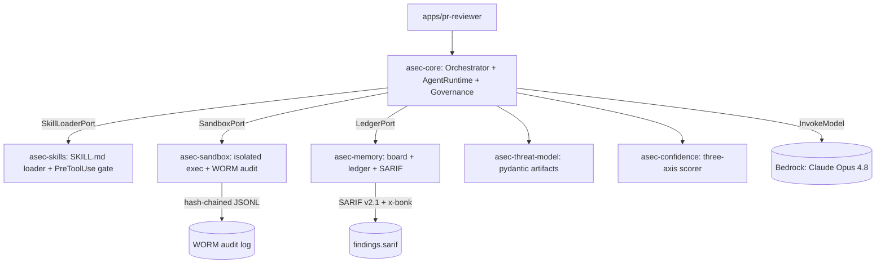

The substrate is the set of trustworthy primitives the v1.3 whitepaper describes. The
whitepaper names **eight foundations**; the v1 repo collapses the two single-consumer
plumbing foundations (`output` → `memory`, `governance` → `core`) into **six packages**,
keeping every distinct seam that owns an EARS invariant.

## High-level architecture

## Why six, not eight or four

- **A proposed 8** — over-splits: `asec-output` and `asec-governance` each have exactly
  one v1 consumer.
- **B proposed 4** — over-merges: folding `threat-model` and `confidence` into `core`
  erases two seams that own distinct EARS invariants (E1/E2, E18) and are independently
  testable pure-logic units.
- **C proposed 6 — the winner.** Keep every whitepaper seam; merge only the two pure
  plumbing packages.

## Dependency direction

Strict and one-way: `apps → packages → asec-core`. No package imports another's concrete
class; cross-package coupling is via `typing.Protocol` re-exported from `asec-core`
(`SandboxPort`, `LedgerPort`, `SkillLoaderPort`). A future `StrandsRuntime` can satisfy
the `AgentRuntime` protocol without inheritance coupling.
